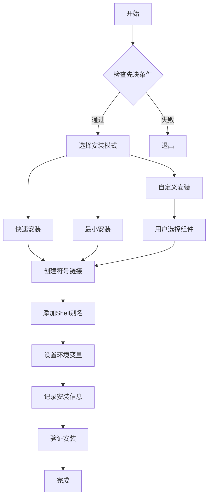

# Web_Fetcher 全局命令架构设计

## 执行摘要

本架构实现了一个**渐进式、可维护、实时同步**的全局命令系统，让`wf`命令在整个macOS系统中可用，同时保持代码修改的即时生效性。

## 架构决策记录 (ADR)

### 决策：采用符号链接 + Shell别名的混合方案

**背景**：
- 用户需要在任何目录使用wf命令
- 代码修改必须立即生效，无需重新安装
- 需要遵循macOS最佳实践

**决策**：
采用**符号链接为主，Shell别名为辅**的混合策略

**原因**：
1. 符号链接提供真正的全局可用性
2. Shell别名作为用户级别的备份方案
3. 两者都支持实时同步
4. 提供渐进式安装选项

**后果**：
- ✅ 最大兼容性
- ✅ 灵活的部署选项
- ⚠️ 略微增加复杂度
- ✅ 可完全回滚

## 系统架构

```
┌─────────────────────────────────────────────┐
│             用户调用 wf 命令                 │
└─────────────────┬───────────────────────────┘
                  │
                  ▼
    ┌─────────────────────────────┐
    │   系统PATH查找 /usr/local/bin │
    └─────────────┬───────────────┘
                  │
                  ▼
    ┌─────────────────────────────┐
    │  /usr/local/bin/wf (符号链接) │
    └─────────────┬───────────────┘
                  │ 实时链接
                  ▼
    ┌─────────────────────────────┐
    │     项目目录/wf.py             │
    │  (实际执行文件，可随时修改)    │
    └─────────────┬───────────────┘
                  │
                  ▼
    ┌─────────────────────────────┐
    │    webfetcher.py              │
    │   (核心功能实现)              │
    └─────────────────────────────┘
```

## 核心组件

### 1. setup_global.sh - 智能安装器
- **功能**：提供交互式安装界面
- **特点**：
  - 自动检测Shell类型
  - 权限智能处理
  - 安装验证
  - 回滚支持

### 2. wf.py - 命令入口
- **功能**：命令行接口包装器
- **特点**：
  - 解析参数
  - 调用webfetcher.py
  - 输出目录管理

### 3. 符号链接机制
```bash
/usr/local/bin/wf -> /Users/.../Project/Web_Fetcher/wf.py
```
- **优势**：标准Unix方式，所有程序可调用
- **实时性**：修改源文件立即生效

### 4. Shell别名备份
```bash
alias wf='python3 /Users/.../Project/Web_Fetcher/wf.py'
```
- **优势**：用户级别，无需sudo
- **限制**：仅交互式Shell可用

## 实现细节

### 安装流程


### 卸载流程
1. 删除符号链接
2. 清理Shell配置
3. 备份配置文件
4. 删除安装标记
5. 保留项目文件

## 输出目录管理策略

优先级（从高到低）：
1. **命令行参数**：`wf URL output_dir`
2. **-o选项**：`wf URL -o ~/Desktop`
3. **环境变量**：`WF_OUTPUT_DIR`
4. **默认值**：`./output/`

## 安全考虑

### 权限管理
- 优先使用用户权限
- 仅在必要时请求sudo
- 保护现有文件（备份机制）

### 路径安全
- 使用绝对路径
- 验证文件存在性
- 防止路径遍历

### 回滚能力
- 保存安装前状态
- 创建配置备份
- 提供完整卸载

## 性能特征

| 操作 | 时间复杂度 | 说明 |
|------|-----------|------|
| 命令调用 | O(1) | 直接符号链接 |
| 代码修改生效 | O(1) | 无需重新安装 |
| 安装过程 | O(1) | 一次性操作 |
| 卸载过程 | O(1) | 简单文件删除 |

## 维护指南

### 日常开发
```bash
# 修改代码
vim webfetcher.py

# 立即测试（无需重装）
wf https://example.com

# 验证安装状态
./setup_global.sh verify
```

### 故障排查
```bash
# 测试实时同步
./test_realtime_sync.sh

# 检查链接
ls -la /usr/local/bin/wf

# 重新安装
./setup_global.sh
```

### 版本升级
1. 直接更新项目文件
2. 无需重新运行setup
3. 新功能立即可用

## 设计原则遵循

### ✅ 渐进式胜过大爆炸
- 提供3种安装级别
- 支持部分安装
- 可逐步升级

### ✅ 务实胜过教条
- 混合使用多种技术
- 适应不同用户需求
- 平衡理想与现实

### ✅ 清晰意图胜过巧妙代码
- 详细的用户提示
- 明确的错误信息
- 自解释的脚本结构

### ✅ 避免过早抽象
- 直接的符号链接
- 简单的Shell脚本
- 最小化依赖

### ✅ 选择无聊但明确的方案
- 标准的/usr/local/bin
- 传统的符号链接
- 常见的Shell配置

## 测试策略

### 单元测试
- 参数解析测试
- 路径处理测试
- 权限检查测试

### 集成测试
- 安装流程测试
- 卸载流程测试
- 实时同步测试

### 用户验收测试
```bash
# 场景1：全新安装
./setup_global.sh

# 场景2：代码修改
vim wf.py
wf test

# 场景3：完全卸载
./uninstall.sh
```

## 未来扩展

### 短期（1-2周）
- [ ] 添加自动更新检查
- [ ] 支持多版本管理
- [ ] 改进错误处理

### 中期（1-2月）
- [ ] Homebrew formula支持
- [ ] 配置文件管理
- [ ] 插件系统

### 长期（3-6月）
- [ ] GUI配置工具
- [ ] 云同步配置
- [ ] 团队共享设置

## 总结

本架构通过**符号链接 + Shell别名**的混合方案，实现了：
1. ✅ 全局命令可用性
2. ✅ 代码修改实时生效
3. ✅ 灵活的安装选项
4. ✅ 安全的卸载机制
5. ✅ 遵循macOS最佳实践

这是一个**实用、可维护、面向未来**的解决方案。