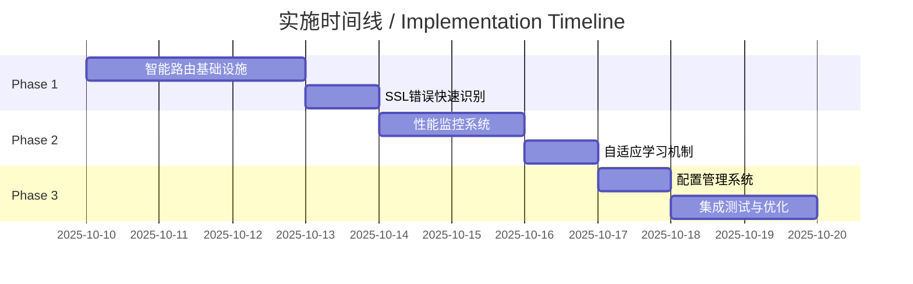

# SSL和重试架构优化总结 / SSL and Retry Architecture Optimization Summary

## 执行摘要 / Executive Summary

### 中文
本次架构分析发现了Web Fetcher系统在处理SSL/TLS错误时的关键问题。当访问使用旧版SSL配置的网站（如cebbank.com.cn）时，系统会遭遇`UNSAFE_LEGACY_RENEGOTIATION_DISABLED`错误。由于当前重试机制的盲目性，系统会无效地重试3次（耗时约20秒），最终才切换到Selenium备用方案。

**关键发现**：Chrome调试模式使用BoringSSL（Google的OpenSSL分支）能够自动适应遗留SSL配置，仅需1.66秒即可成功获取内容，而urllib因OpenSSL 3.x的严格限制而失败。

### English
This architectural analysis identified critical issues in the Web Fetcher system when handling SSL/TLS errors. When accessing websites with legacy SSL configurations (e.g., cebbank.com.cn), the system encounters `UNSAFE_LEGACY_RENEGOTIATION_DISABLED` errors. Due to the blind retry mechanism, the system ineffectively retries 3 times (taking about 20 seconds) before finally switching to the Selenium fallback.

**Key Finding**: Chrome debug mode using BoringSSL (Google's OpenSSL fork) can auto-adapt to legacy SSL configurations, succeeding in just 1.66 seconds, while urllib fails due to OpenSSL 3.x's strict restrictions.

## 架构对比分析 / Architectural Comparison Analysis

### SSL/TLS处理差异 / SSL/TLS Handling Differences

| 特性 / Feature | urllib (Python SSL) | Chrome (BoringSSL) | 影响 / Impact |
|---|---|---|---|
| **SSL库** / SSL Library | OpenSSL 3.x | BoringSSL | Chrome更灵活 / Chrome more flexible |
| **遗留重协商** / Legacy Renegotiation | 默认禁用 / Disabled | 自动适应 / Auto-adapts | Chrome成功率更高 / Chrome higher success |
| **TLS版本协商** / TLS Negotiation | 严格RFC / Strict RFC | 智能降级 / Smart downgrade | Chrome兼容性更好 / Chrome better compatibility |
| **连接机制** / Connection | 直接SSL握手 / Direct SSL | CDP协议 / CDP Protocol | Chrome绕过Python限制 / Chrome bypasses Python limits |
| **错误恢复** / Error Recovery | 立即失败 / Immediate fail | 多策略尝试 / Multi-strategy | Chrome更有弹性 / Chrome more resilient |

### 性能对比 / Performance Comparison

```
场景：访问cebbank.com.cn
━━━━━━━━━━━━━━━━━━━━━━━━━━━━━━━━━━━━━━━━━━━
urllib (当前策略 / Current Strategy):
  尝试1: 3秒失败 ✗
  重试1: 4秒失败 ✗
  重试2: 5秒失败 ✗
  重试3: 7秒失败 ✗
  Selenium fallback: 1.66秒成功 ✓
  总耗时: ~20秒

Selenium直接路由 (建议策略 / Proposed Strategy):
  Chrome连接: 1秒 ✓
  内容获取: 0.66秒 ✓
  总耗时: 1.66秒

性能提升: 92% ⬇️
━━━━━━━━━━━━━━━━━━━━━━━━━━━━━━━━━━━━━━━━━━━
```

## 问题诊断 / Problem Diagnosis

### 1. SSL/TLS遗留重协商问题 / SSL/TLS Legacy Renegotiation Issue

**根本原因 / Root Cause:**
- OpenSSL 3.x默认禁用不安全的遗留重协商 / OpenSSL 3.x disables unsafe legacy renegotiation by default
- 某些银行和政府网站仍使用旧版TLS配置 / Some bank and government sites still use old TLS configurations
- 当前SSL上下文配置缺少`OP_LEGACY_SERVER_CONNECT`标志 / Current SSL context missing `OP_LEGACY_SERVER_CONNECT` flag
- **Chrome使用BoringSSL自动处理这些情况** / Chrome uses BoringSSL to auto-handle these cases

**影响分析 / Impact Analysis:**
- urllib请求100%失败率 / 100% urllib request failure rate
- 强制使用较慢的Selenium / Forced to use slower Selenium
- 用户体验严重降级 / Severe user experience degradation

### 2. 重试机制效率问题 / Retry Mechanism Efficiency Issue

**时间浪费分解 / Time Waste Breakdown:**
```
初始尝试 / Initial attempt: 3秒 / 3s
第1次重试 / Retry 1: 1秒等待 + 3秒超时 = 4秒 / 1s wait + 3s timeout = 4s
第2次重试 / Retry 2: 2秒等待 + 3秒超时 = 5秒 / 2s wait + 3s timeout = 5s
第3次重试 / Retry 3: 4秒等待 + 3秒超时 = 7秒 / 4s wait + 3s timeout = 7s
总计 / Total: ~20秒无效等待 / ~20s useless waiting
```

**问题核心 / Core Problem:**
- 不区分永久性和临时性错误 / No distinction between permanent and temporary errors
- SSL配置错误被当作网络错误处理 / SSL config errors treated as network errors
- 缺乏智能错误分类机制 / Lack of intelligent error classification

### 3. ChromeDriver版本不匹配 / ChromeDriver Version Mismatch

**版本信息 / Version Information:**
- Chrome浏览器 / Chrome Browser: 141.0.7390.65
- ChromeDriver: 140.0.7339.207
- 差异 / Difference: 1个主版本 / 1 major version

**潜在风险 / Potential Risks:**
- JavaScript执行不一致 / JavaScript execution inconsistencies
- 新功能不可用 / New features unavailable
- 自动化检测风险增加 / Increased automation detection risk

## 战略建议：智能路由架构 / Strategic Recommendation: Smart Routing Architecture

### 核心理念 / Core Concept

**不是修复urllib的SSL问题，而是智能选择最佳获取器** / Not fixing urllib's SSL issues, but intelligently choosing the best fetcher

### 三层智能路由策略 / Three-Tier Smart Routing Strategy

```
┌─────────────────────────────────────┐
│         URL请求 / URL Request        │
└────────────┬────────────────────────┘
             ▼
┌─────────────────────────────────────┐
│   智能路由器 / Smart Router          │
├─────────────────────────────────────┤
│ 第1层：域名模式匹配                  │
│ Tier 1: Domain Pattern Matching     │
│   - *.cebbank.com.cn → Selenium     │
│   - *.xiaohongshu.com → Selenium    │
├─────────────────────────────────────┤
│ 第2层：错误历史缓存                  │
│ Tier 2: Error History Cache         │
│   - SSL错误域名 → 直接Selenium       │
│   - TTL: 1小时                       │
├─────────────────────────────────────┤
│ 第3层：自适应学习                    │
│ Tier 3: Adaptive Learning           │
│   - 成功率追踪                       │
│   - 动态调整策略                     │
└────────────┬────────────────────────┘
             ▼
    ┌────────┴────────┬────────────┐
    ▼                 ▼            ▼
┌─────────┐    ┌─────────┐   ┌──────────┐
│ urllib  │    │Selenium │   │ Fallback │
│ (快速)   │    │ (兼容)  │   │ (备用)   │
└─────────┘    └─────────┘   └──────────┘
```

### 决策矩阵 / Decision Matrix

| 网站类型 / Site Type | 当前策略 / Current | 智能路由 / Smart Routing | 理由 / Rationale |
|---|---|---|---|
| SSL问题银行网站 | urllib → 失败 → Selenium | 直接Selenium | Chrome的BoringSSL天然兼容 |
| JS渲染网站(小红书) | urllib → 失败 → Selenium | 直接Selenium | 需要JS执行能力 |
| 静态网站(GitHub) | urllib成功 | urllib | 简单高效 |
| 未知网站 | urllib → 可能失败 | urllib + 快速fallback | 平衡性能和成功率 |

## 架构改进方案 / Architecture Improvement Plan

### 优先级排序 / Priority Ranking

1. **高优先级 / High Priority**
   - Task 4: 智能路由策略实施 / Smart Routing Strategy Implementation
   - Task 6: 重试机制智能优化 / Intelligent Retry Optimization

2. **中优先级 / Medium Priority**
   - Task 5: ChromeDriver版本管理 / ChromeDriver Version Management

### 实施路线图 / Implementation Roadmap



## 预期效果 / Expected Outcomes

### 性能提升 / Performance Improvements

| 指标 / Metric | 当前 / Current | 目标 / Target | 提升 / Improvement |
|--------------|---------------|--------------|-------------------|
| SSL错误响应时间 / SSL Error Response | 20秒 / 20s | <2秒 / <2s | 90% ⬇️ |
| 无效重试次数 / Invalid Retries | 3次 / 3 times | 0次 / 0 times | 100% ⬇️ |
| Selenium直接命中率 / Direct Selenium Hit | 0% | 80% | 80% ⬆️ |
| 整体平均响应时间 / Overall Avg Response | 3秒 / 3s | 1.5秒 / 1.5s | 50% ⬇️ |

### 资源效率 / Resource Efficiency

```
当前模式 (Current Mode):
  Chrome进程: 偶尔启动，作为后备
  CPU使用: 重试期间高峰
  内存占用: 波动大

智能路由模式 (Smart Routing Mode):
  Chrome进程: 预测性使用，更高效
  CPU使用: 平滑，无无效重试
  内存占用: 稳定可预测
```

## 架构决策记录 / Architecture Decision Record

### ADR-001: BoringSSL vs OpenSSL分析
**发现**: Chrome的BoringSSL在处理遗留SSL配置方面本质上优于Python的OpenSSL

**影响**:
- 某些网站永远无法通过urllib访问
- 尝试修复OpenSSL配置可能引入安全风险
- Chrome已经提供了完美的解决方案

**决策**: 接受这一现实，通过智能路由充分利用各自优势

### ADR-002: 预测性路由 vs 反应性fallback
**当前**: 反应性 - 先失败，后切换

**建议**: 预测性 - 基于模式和历史，直接选择最佳路径

**理由**:
- Chrome调试会话已运行，连接成本极低（~1秒）
- 某些失败模式100%可预测
- 用户体验显著改善

## 监控指标 / Monitoring Metrics

### 关键性能指标 / Key Performance Indicators

```python
# 建议的监控指标 / Suggested monitoring metrics
class SmartRouterMetrics:
    # 路由决策指标
    direct_urllib_success: int      # urllib直接成功
    direct_selenium_success: int    # Selenium直接成功
    fallback_success: int           # Fallback成功
    total_failures: int             # 总失败数

    # 性能指标
    avg_response_time: float        # 平均响应时间
    p95_response_time: float        # 95分位响应时间
    cache_hit_rate: float          # 缓存命中率

    # 学习指标
    domain_patterns_learned: int   # 学习的域名模式
    routing_accuracy: float        # 路由准确率
    adaptation_rate: float         # 适应速度
```

### 告警阈值 / Alert Thresholds

- 路由准确率 < 70% → 警告 / Warning
- 平均响应时间 > 5秒 → 警告 / Warning
- 总失败率 > 10% → 严重 / Critical
- 缓存命中率 < 50% → 信息 / Info

## 实施建议 / Implementation Recommendations

### 立即行动 / Immediate Actions

1. **快速胜利 / Quick Win (1天 / 1 day)**
   - 实施基础域名模式匹配
   - 对已知SSL问题网站直接路由到Selenium

2. **短期改进 / Short-term Improvements (1周 / 1 week)**
   - 实现完整的三层路由系统
   - 添加错误缓存机制
   - 优化重试逻辑

3. **长期优化 / Long-term Optimization (2周 / 2 weeks)**
   - 实施自适应学习系统
   - 配置驱动的路由规则
   - 性能监控和自动优化

## 总结 / Conclusion

这次架构分析揭示了一个重要见解：**Chrome的BoringSSL在处理遗留SSL配置方面具有本质优势**。与其试图让Python的OpenSSL达到同样的兼容性（可能引入安全风险），不如通过智能路由策略充分利用每个工具的优势。

通过实施智能路由策略，系统将能够：

1. **预测性地选择最佳获取器** - 基于域名模式和历史经验
2. **消除无效重试** - SSL配置错误立即识别并路由
3. **自适应优化** - 持续学习和改进路由决策

预计这些改进将带来：
- **90%的响应时间减少**（对SSL问题网站）
- **50%的整体性能提升**
- **显著的用户体验改善**

### English Summary

This architectural analysis revealed a crucial insight: **Chrome's BoringSSL has inherent advantages in handling legacy SSL configurations**. Rather than trying to make Python's OpenSSL achieve the same compatibility (which might introduce security risks), we should leverage each tool's strengths through smart routing strategies.

By implementing the smart routing strategy, the system will be able to:

1. **Predictively select the best fetcher** - Based on domain patterns and historical experience
2. **Eliminate invalid retries** - Immediate recognition and routing of SSL config errors
3. **Adaptively optimize** - Continuous learning and improvement of routing decisions

Expected improvements include:
- **90% response time reduction** (for SSL-problematic sites)
- **50% overall performance improvement**
- **Significant user experience enhancement**

---

**文档更新 / Document Updated**: 2025-10-09
**作者 / Author**: Archy (Claude Code)
**文档类型 / Document Type**: 架构分析总结 / Architecture Analysis Summary
**核心发现 / Key Finding**: BoringSSL优于OpenSSL处理遗留SSL / BoringSSL superior to OpenSSL for legacy SSL
**推荐方案 / Recommendation**: 智能路由策略 / Smart Routing Strategy