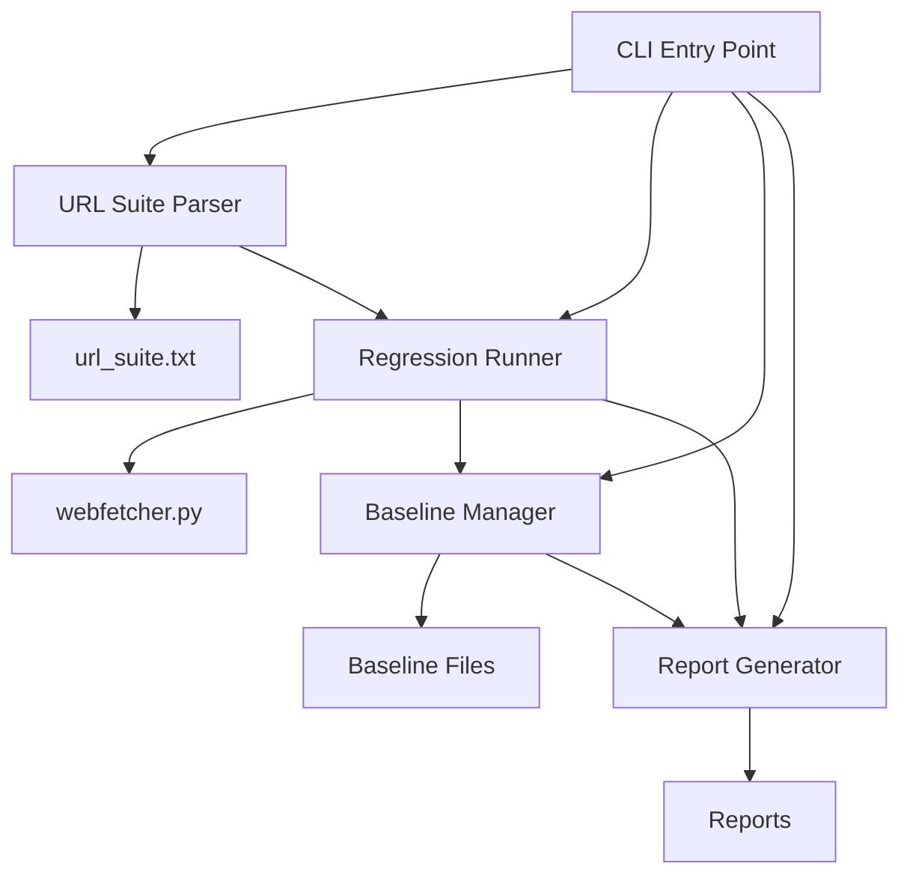

# Developer Guide - Regression Test Harness
# 开发者指南 - 回归测试工具

**For contributors and extenders**
**面向贡献者和扩展者**

---

## Table of Contents / 目录

1. [Architecture Overview](#architecture-overview--架构概述)
2. [Component Details](#component-details--组件详情)
3. [Adding New Features](#adding-new-features--添加新功能)
4. [Testing Guidelines](#testing-guidelines--测试指南)
5. [Code Style](#code-style--代码风格)
6. [Contribution Process](#contribution-process--贡献流程)

---

## Architecture Overview / 架构概述

### System Architecture / 系统架构



### Component Responsibilities / 组件职责

1. **url_suite_parser.py**: Parse and filter test URLs
   - Read suite file
   - Validate format
   - Tag-based filtering
   - Statistics

2. **regression_runner.py**: Execute tests
   - Run individual tests
   - Collect metrics
   - Handle timeouts
   - Progress tracking

3. **baseline_manager.py**: Baseline operations
   - Save baselines
   - Load baselines
   - Compare results
   - Detect regressions

4. **report_generator.py**: Generate reports
   - Multiple formats (Markdown/JSON/Text)
   - Summary statistics
   - Detailed results

5. **run_regression_suite.py**: CLI interface
   - Argument parsing
   - Workflow orchestration
   - User interaction

---

## Component Details / 组件详情

### URL Suite Parser

**File**: `tests/regression/url_suite_parser.py`

**Key Classes**:
```python
@dataclass
class URLTest:
    url: str
    description: str
    expected_strategy: str
    tags: Set[str]
    line_number: int
```

**Key Functions**:
```python
def parse_url_suite(filepath: Path) -> List[URLTest]:
    """Parse URL suite file"""

def filter_by_tags(
    tests: List[URLTest],
    include_tags: Optional[Set[str]] = None,
    exclude_tags: Optional[Set[str]] = None
) -> List[URLTest]:
    """Filter tests by tags"""
```

**Extension Points**:
- Add new URL validation rules
- Support alternative suite formats
- Custom tag logic

### Regression Runner

**File**: `tests/regression/regression_runner.py`

**Key Classes**:
```python
class TestStatus(Enum):
    PASSED = "PASSED"
    FAILED = "FAILED"
    SKIPPED = "SKIPPED"
    ERROR = "ERROR"

@dataclass
class TestResult:
    test: URLTest
    status: TestStatus
    duration: float
    content_size: int
    error_message: str
    fetch_metrics: FetchMetrics
    strategy_used: str
```

**Key Methods**:
```python
class RegressionRunner:
    def run_test(self, test: URLTest) -> TestResult:
        """Run single test"""

    def run_suite(
        self,
        tests: List[URLTest],
        progress_callback: Optional[Callable] = None
    ) -> List[TestResult]:
        """Run test suite"""
```

**Extension Points**:
- Add new test execution strategies
- Custom metric collection
- Alternative progress displays

### Baseline Manager

**File**: `tests/regression/baseline_manager.py`

**Key Classes**:
```python
@dataclass
class Baseline:
    name: str
    timestamp: str
    suite_file: str
    results: List[TestResult]
    metadata: Dict[str, Any]

@dataclass
class BaselineComparison:
    baseline: Baseline
    current_results: List[TestResult]
    summary: str
    regressions: List[Dict[str, Any]]
    improvements: List[Dict[str, Any]]
```

**Extension Points**:
- Custom regression detection rules
- Alternative comparison metrics
- Baseline storage backends

### Report Generator

**File**: `tests/regression/report_generator.py`

**Key Methods**:
```python
class ReportGenerator:
    def generate_markdown(
        self,
        comparison: Optional[BaselineComparison] = None
    ) -> str:
        """Generate Markdown report"""

    def generate_json(
        self,
        comparison: Optional[BaselineComparison] = None
    ) -> str:
        """Generate JSON report"""
```

**Extension Points**:
- Add new report formats (HTML, XML, etc.)
- Custom report templates
- External integrations

---

## Adding New Features / 添加新功能

### Adding a New Report Format

**Example: HTML Report**

```python
# In report_generator.py

def generate_html(
    self,
    comparison: Optional[BaselineComparison] = None
) -> str:
    """
    Generate HTML report.
    生成 HTML 报告。
    """
    html = []

    # Header
    html.append('<!DOCTYPE html>')
    html.append('<html><head>')
    html.append('<title>Regression Test Report</title>')
    html.append('</head><body>')

    # Summary
    summary = self.get_summary()
    html.append(f'<h1>Test Results</h1>')
    html.append(f'<p>Total: {summary["total"]}</p>')
    html.append(f'<p>Passed: {summary["passed"]}</p>')

    # Results table
    html.append('<table>')
    for result in self.results:
        html.append(f'<tr>')
        html.append(f'<td>{result.test.url}</td>')
        html.append(f'<td>{result.status.value}</td>')
        html.append(f'</tr>')
    html.append('</table>')

    html.append('</body></html>')
    return '\n'.join(html)
```

### Adding a New Validation Rule

**Example: URL Response Time Threshold**

```python
# In regression_runner.py

def run_test(self, test: URLTest) -> TestResult:
    """Run single test with duration check"""
    start_time = time.time()

    # ... existing test logic ...

    duration = time.time() - start_time

    # New validation: warn if too slow
    if duration > 10.0 and 'slow' not in test.tags:
        error_message = f"Warning: Test took {duration:.2f}s but not tagged as 'slow'"

    # ... rest of logic ...
```

### Adding Custom Metrics

**Example: Track Response Headers**

```python
# In regression_runner.py

@dataclass
class TestResult:
    # ... existing fields ...
    response_headers: Dict[str, str] = None  # New field

def run_test(self, test: URLTest) -> TestResult:
    # ... fetch content ...

    # Capture headers
    headers = {}
    if hasattr(response, 'headers'):
        headers = dict(response.headers)

    return TestResult(
        # ... existing fields ...
        response_headers=headers
    )
```

---

## Testing Guidelines / 测试指南

### Testing Your Changes

1. **Unit Tests**: Test individual components
```python
def test_url_suite_parser():
    """Test suite parsing"""
    tests = parse_url_suite(Path('tests/url_suite.txt'))
    assert len(tests) > 0
    assert all(t.url.startswith('http') for t in tests)
```

2. **Integration Tests**: Test component interaction
```python
def test_full_regression_flow():
    """Test complete regression flow"""
    tests = parse_url_suite(Path('tests/url_suite.txt'))
    runner = RegressionRunner()
    results = runner.run_suite(tests[:5])  # Test first 5
    assert all(r.duration > 0 for r in results)
```

3. **Manual Testing**: Test CLI interface
```bash
python scripts/run_regression_suite.py --tags fast
python scripts/run_regression_suite.py --save-baseline test
python scripts/run_regression_suite.py --baseline baselines/test.json
```

### Test Coverage Expectations

- **Core Components**: >80% coverage
- **CLI Interface**: Manual testing required
- **Integration**: End-to-end scenarios
- **Error Handling**: Test failure cases

---

## Code Style / 代码风格

### Python Style Guide

Follow PEP 8 with these specifics:

```python
# Imports
import sys
from pathlib import Path
from typing import List, Dict, Optional

# Constants
DEFAULT_TIMEOUT = 30
MAX_RETRIES = 3

# Classes
class ComponentName:
    """
    Brief description.
    简短描述。

    Detailed explanation in English.
    中文详细说明。
    """
    pass

# Functions
def function_name(param: str) -> bool:
    """
    Brief description.
    简短描述。

    Args:
        param: Description / 描述

    Returns:
        Description / 描述
    """
    pass
```

### Bilingual Comments

All user-facing strings and docstrings should be bilingual:

```python
# Good
print("Test passed / 测试通过")

# Bad
print("Test passed")
```

### Type Hints

Use type hints for all public APIs:

```python
def parse_results(
    filepath: Path,
    include_errors: bool = False
) -> List[TestResult]:
    """Parse results with type hints"""
    pass
```

---

## Contribution Process / 贡献流程

### Step 1: Fork and Clone

```bash
git clone https://github.com/yourusername/Web_Fetcher.git
cd Web_Fetcher
```

### Step 2: Create Branch

```bash
git checkout -b feature/my-new-feature
```

### Step 3: Make Changes

- Write code following style guide
- Add tests for new functionality
- Update documentation
- Test thoroughly

### Step 4: Test Locally

```bash
# Run regression tests
python scripts/run_regression_suite.py --tags fast

# Test your changes
python scripts/run_regression_suite.py --tags <relevant>
```

### Step 5: Commit

```bash
git add .
git commit -m "feat: Add new report format for HTML

- Implement HTML report generator
- Add CSS styling
- Update documentation

🤖 Generated with Claude Code

Co-Authored-By: Claude <noreply@anthropic.com>"
```

### Step 6: Push and PR

```bash
git push origin feature/my-new-feature
# Create pull request on GitHub
```

### PR Checklist

- [ ] Code follows style guide
- [ ] Tests added/updated
- [ ] Documentation updated
- [ ] Bilingual comments/messages
- [ ] Regression tests pass
- [ ] No breaking changes (or documented)
- [ ] Commit messages clear

---

## API Reference / API 参考

### Parse URL Suite

```python
from tests.regression.url_suite_parser import parse_url_suite

tests = parse_url_suite(Path('tests/url_suite.txt'))
# Returns: List[URLTest]
```

### Run Tests

```python
from tests.regression.regression_runner import RegressionRunner

runner = RegressionRunner(timeout=30)
results = runner.run_suite(tests)
# Returns: List[TestResult]
```

### Manage Baselines

```python
from tests.regression.baseline_manager import BaselineManager

manager = BaselineManager()
manager.save_baseline('v1.0', results)
baseline = manager.load_baseline('baselines/v1.0.json')
comparison = manager.compare(baseline, results)
```

### Generate Reports

```python
from tests.regression.report_generator import ReportGenerator

generator = ReportGenerator(results, 'url_suite.txt')
markdown = generator.generate_markdown()
json_report = generator.generate_json()
```

---

## Extension Examples / 扩展示例

See `tests/regression/examples/` for:

- **custom_report_template.py**: Custom report formats
- **slack_notifier.py**: External integrations
- **daily_regression.sh**: Automation scripts

---

## Getting Help / 获取帮助

- **Documentation**: See `README.md`
- **Issues**: GitHub Issues
- **Questions**: Discussions tab

---

**Version**: 1.0.0
**Last Updated**: 2025-10-10
